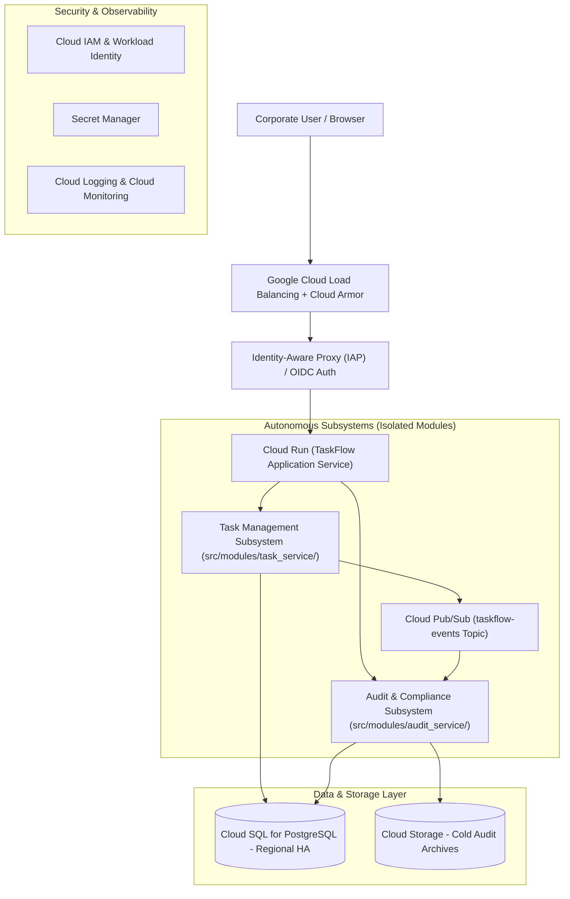

# System Architecture Specification: TaskFlow

> **Status**: `FROZEN / MACRO-ARCHITECTURE BASELINE (Gate 0)`  
> **Source**: Lead Cloud Architect (`/architect-design`)  
> **Contractual Input**: [`docs/PRD.md`](file:///home/user/todo-maestro/docs/PRD.md)  
> **Governance**: All downstream subsystem tech leads (`/lead-decompose`) and developers (`/implement`) must conform to the subsystem boundaries and WAF pillars defined herein.

---

## 1. Executive Summary & Macro-Topology

TaskFlow is an enterprise follow-the-sun task service built with Flask (Python) offering both a clean JSON REST API and a server-rendered web UI. Designed for global 24/7 continuous operations across APAC, EMEA, and Americas time zones, the architecture emphasizes high availability, zero committed write data loss, tamper-evident audit logging, and responsive task handoffs.

### Component Topology Diagram



---

## 2. Subsystem Macro-Decomposition

The architecture decomposes TaskFlow into two highly cohesive, loosely coupled subsystems to enforce clear domain isolation:

| Subsystem Name | Directory Root | Core Responsibilities & Domain | Allowed External Dependencies | Assigned Worker |
|---|---|---|---|---|
| **task_service** | `src/modules/task_service/` | Task CRUD, status state machine (`open → in-progress → done`), task history append-only trail, assignment, follow-the-sun handoffs, user profile query, notification event dispatch, and server-rendered Flask web UI (`src/modules/task_service/frontend/`). | Cloud SQL, Pub/Sub | `subagent-task_service` |
| **audit_service** | `src/modules/audit_service/` | Tamper-evident append-only audit event recording, structured query and filter engine across actor/task/action/time, and immutable audit trail export generation. | Cloud SQL, Cloud Storage | `subagent-audit_service` |

---

## 3. Frozen Cloud Service Decisions

This table is the **authoritative, frozen** record of concrete GCP products this architecture commits to. The mechanical Gate 1 auditor reads service selections from **this table only**. Every row names a concrete GCP product and states the WAF driver that justifies it.

| Architectural Concern | Chosen GCP Service | Rationale (WAF Driver) |
|---|---|---|
| Compute | Cloud Run | Scale-to-zero serverless container runtime with request-based auto-scaling and minimum warm instances — System Design & Cost Optimization (ADR-0001) |
| Primary Datastore | Cloud SQL | ACID relational PostgreSQL with synchronous multi-zone Regional High Availability and automated backups — Reliability & System Design (ADR-0002) |
| Asynchronous Messaging | Pub/Sub | Serverless at-least-once distributed messaging for out-of-band notifications and event streaming — System Design & Reliability (ADR-0003) |
| Perimeter & Edge | Cloud Load Balancing | Global external HTTPS load balancing with TLS 1.3 termination and URL map routing — Performance & Security |
| Secrets Management | Secret Manager | Centralized secret storage, automatic rotation, and IAM-restricted access for zero plaintext credentials — Security |
| Observability | Cloud Logging | Centralized structured JSON logging, error reporting, and SLO budget tracking — Operational Excellence |

---

## 4. Google Cloud Well-Architected Framework (WAF) Compliance

### 4.1 System Design
TaskFlow adopts a cloud-native, serverless container execution model running on Google Cloud Run. The application is packaged as a standard stateless OCI container. The request-serving tier scales horizontally from warm baseline instances up to dozens of concurrent containers, handling traffic spikes during global handoff windows without capacity ceilings. Database access leverages connection pooling through Cloud SQL Auth Proxy to prevent connection exhaustion.
* **Official Documentation Citation**: https://cloud.google.com/architecture/framework/system-design

### 4.2 Operational Excellence
The system exposes standardized `/healthz` (liveness) and `/readyz` (readiness) HTTP endpoints. Structured JSON logs are streamed to Google Cloud Logging with request correlation IDs injected at ingress. Metrics for request latency, error rates, and saturation are monitored in Cloud Monitoring with alerting policies configured for the 99% monthly availability SLO and error budget burn rates. Schema migrations follow backward-compatible expand/contract patterns.
* **Official Documentation Citation**: https://cloud.google.com/architecture/framework/operational-excellence

### 4.3 Security, Privacy, and Compliance
All ingress traffic is authenticated via Google Cloud Identity-Aware Proxy (IAP) and enterprise OIDC Single Sign-On (ADR-0004). Fine-grained Role-Based Access Control (RBAC) is enforced server-side for Employee, Team Lead, Auditor, and Administrator roles. Principle of least privilege is enforced via dedicated service accounts without broad primitive roles. Secrets (DB credentials, signing keys) reside in Google Cloud Secret Manager. All network communication requires TLS 1.3, and data is encrypted at rest using Google-managed encryption keys.
* **Official Documentation Citation**: https://cloud.google.com/architecture/framework/security

### 4.4 Reliability and Disaster Recovery
To satisfy NFR-REL-1 (99% monthly availability) and NFR-REL-3 (durability of committed transactions), Cloud SQL PostgreSQL is provisioned with Regional High Availability across two zones with automated failover. Point-in-time recovery (PITR) with continuous write-ahead log (WAL) archiving guarantees RPO <= 15 minutes and RTO <= 1 hour. Non-critical operations such as notification alerts are decoupled via Pub/Sub to ensure graceful degradation: notification gateway slowdowns never impede core task CRUD.
* **Official Documentation Citation**: https://cloud.google.com/architecture/framework/reliability

### 4.5 Cost Optimization
In alignment with NFR-COST-1 and NFR-COST-2, Cloud Run scales compute capacity dynamically according to incoming request concurrency, eliminating fixed 24/7 idle server costs. Cloud SQL instance sizing is matched to the launch scale (1,000 concurrent users), avoiding premature multi-region active-active clusters such as Cloud Spanner that carry heavy monthly minimum commitments. Monotonically growing audit trails are tiered to Cloud Storage Coldline buckets for cost-effective retention.
* **Official Documentation Citation**: https://cloud.google.com/architecture/framework/cost-optimization

### 4.6 Performance Optimization
Read latency is optimized to meet p95 < 300 ms through database indexing on task owners, status, assignees, and due dates. Write operations meet p95 < 500 ms by executing concise single-transaction updates and offloading notification side-effects to asynchronous Pub/Sub handlers. Static web assets are served with HTTP cache headers and gzip compression.
* **Official Documentation Citation**: https://cloud.google.com/architecture/framework/performance

### 4.7 Sustainability
Compute workloads and database instances are deployed in carbon-optimized Google Cloud regions (e.g. `europe-west1` or `us-central1`), minimizing carbon footprint while maintaining low-latency connectivity to global hubs. Horizontal auto-scaling ensures that compute resources are consumed only when actively processing tasks.
* **Official Documentation Citation**: https://cloud.google.com/architecture/framework/sustainability

---

## 5. Cross-Cutting Infrastructural Blueprint

* **Ingress & Routing**: Global External HTTPS Load Balancer with Cloud Armor edge policies.
* **Authentication**: IAP JWT token extraction and cryptographic signature validation in Flask middleware.
* **Inter-Service Communication**: In-process domain calls between clean architecture modules; asynchronous event broadcasting over Cloud Pub/Sub.
* **Auditability**: Tamper-evident audit events appended synchronously on state changes and forwarded to `src/modules/audit_service/`.

---

## 6. Gate 0 Verification & Subsystem Hand-Off

* **Mechanical WAF Gate**:
  ```bash
  uv run python3 scripts/audit_waf_compliance.py docs/architecture.md
  ```
* **Downstream Subsystems**:
  1. `src/modules/task_service/` (Interface contract: `openapi.yaml`, Specification: `SPEC.md`, UI Contract: `ui-spec.json`)
  2. `src/modules/audit_service/` (Interface contract: `openapi.yaml`, Specification: `SPEC.md`)
