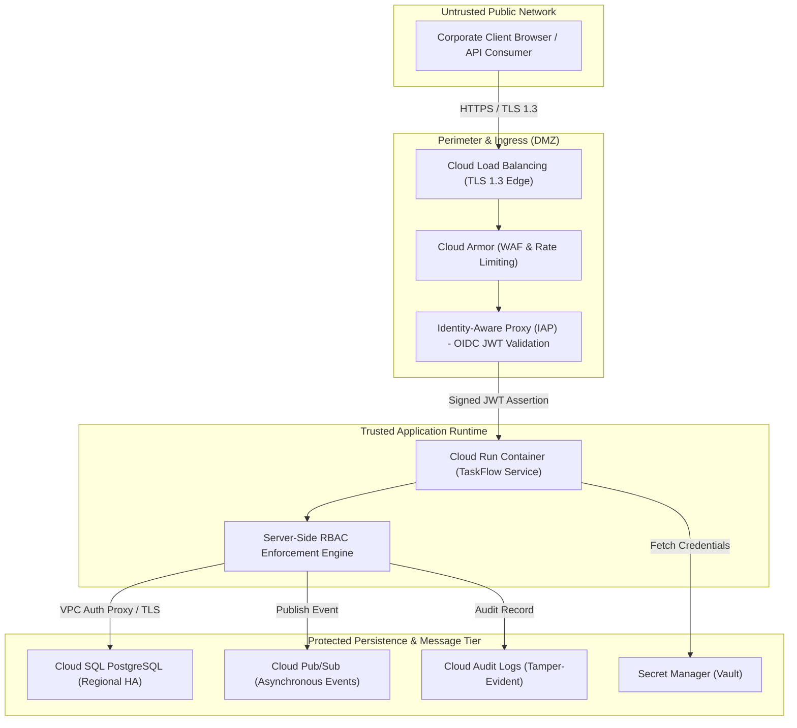

# Security Architecture & STRIDE Threat Model: TaskFlow

> **Status**: `FROZEN / BASELINE (Gate Security)`  
> **Source**: Security Architect (`/secops-audit`)  
> **Contractual Input**: [`docs/PRD.md`](file:///home/user/todo-maestro/docs/PRD.md), [`docs/architecture.md`](file:///home/user/todo-maestro/docs/architecture.md)

---

## 1. Security Overview

TaskFlow is designed under a Zero Trust security architecture for enterprise task collaboration across global operating zones. All user interactions are authenticated at perimeter ingress and authorized server-side on every request. Data protection is maintained throughout the entire lifecycle: TLS 1.3 in transit, AES-256 encryption at rest, tamper-evident append-only audit logging for compliance, and strict least-privilege IAM access.

This security blueprint satisfies all PRD Security NFRs:
* **NFR-SEC-1**: Mandatory authentication via enterprise SSO / OIDC identity provider; no plaintext passwords.
* **NFR-SEC-2**: Server-side authorization verification on every request using role-based access control (RBAC).
* **NFR-SEC-3**: End-to-end encryption in transit (TLS 1.3) and encryption at rest for databases and backups.
* **NFR-SEC-4**: Append-only tamper-evident audit log with zero task content or secrets in logs.
* **NFR-SEC-5**: Privacy and least-privilege scoping across Employee, Team Lead, Auditor, and Administrator roles.
* **NFR-SEC-6**: Data retention and compliance policies for task history and audit logs.

---

## 2. Trust Boundaries & Data Flow

The following Mermaid diagram maps the trust zones, data flows, and perimeter controls governing TaskFlow:

---

## 3. STRIDE Threat Analysis

A comprehensive threat analysis covering all six STRIDE categories with corresponding architectural mitigations and mechanical verifications:

| Threat Category | Specific Threat Description | Affected Component | Architectural Mitigation | Verification Method |
|---|---|---|---|---|
| **Spoofing** | Attacker injects forged user headers (`X-User-Email`) to impersonate other employees or administrators. | Ingress / Cloud Run | IAP cryptographically signs assertion JWTs using Google Cloud keys; application verifies JWT signature, issuer, and audience before trusting user identity (NFR-SEC-1). | Contract and unit tests verifying rejected forged tokens; SAST inspection. |
| **Tampering** | Malicious actor modifies task history entries, status timestamps, or audit logs directly in transit or at rest. | Cloud SQL / Pub/Sub | Append-only database schemas with immutable history records; TLS 1.3 encryption for all connections; audit log entries lack update/delete endpoints (NFR-SEC-3, NFR-SEC-4). | Automated SQL trigger tests and database integrity assertions preventing updates to history/audit tables. |
| **Repudiation** | Employee denies performing a task reassignment, soft-deletion, or permission delegation. | Task Service / Audit Log | Synchronous emission of tamper-evident audit events recording actor identity, client IP, action type, before/after values, and UTC timestamp (NFR-SEC-4). | Gate 4 behavioral tests verifying audit event emission on every state change. |
| **Information Disclosure** | Unauthorized user reads private task notes or leaks sensitive company data through search or API. | Task API / Search | Strict server-side RBAC checks in `src/modules/task_service/` ensuring only the task owner or explicitly granted collaborators can read task content (NFR-SEC-5). | Automated negative permission test suites asserting 403 Forbidden on non-shared tasks. |
| **Denial of Service** | Volumetric HTTP floods or abusive recursive queries exhaust application CPU or database connection pools. | Ingress / Cloud SQL | Cloud Armor rate limiting at perimeter; Cloud Run request concurrency limits (80/instance); connection pooling via Cloud SQL Auth Proxy. | Synthetic load testing; Cloud Armor rate-limiting rule audit. |
| **Elevation of Privilege** | Standard employee attempts administrative user provisioning or offboarding actions. | User API / Admin endpoints | Route-level `@require_role('admin')` decorators verifying user role from verified identity token before executing privileged actions (NFR-SEC-2). | Negative integration test asserting 403 Forbidden for non-admin accounts. |

---

## 4. IAM Least-Privilege Role Matrix

TaskFlow enforces Google Cloud IAM least privilege using dedicated service accounts with tightly scoped permissions. Broad primitive GCP roles (such as project-level Owner or Editor) are strictly avoided.

| Service Account | Component / Workload | Assigned IAM Roles | Justification |
|---|---|---|---|
| `sa-taskflow-app@gcp-project.iam.gserviceaccount.com` | Cloud Run Service | `roles/cloudsql.client`, `roles/pubsub.publisher`, `roles/secretmanager.secretAccessor`, `roles/logging.logWriter` | Access database via Auth Proxy, publish asynchronous events, retrieve database passwords, and stream structured logs. |
| `sa-taskflow-worker@gcp-project.iam.gserviceaccount.com` | Pub/Sub Event Subscriber | `roles/pubsub.subscriber`, `roles/logging.logWriter` | Pull asynchronous notifications and deadline events from topic subscriptions. |
| `sa-taskflow-auditor@gcp-project.iam.gserviceaccount.com` | Audit Export Engine | `roles/storage.objectAdmin`, `roles/logging.viewer` | Write exported audit archives to cold storage buckets and read audit log entries. |
| `sa-taskflow-ci@gcp-project.iam.gserviceaccount.com` | Cloud Build CI/CD | `roles/run.developer`, `roles/artifactregistry.writer`, `roles/iam.serviceAccountUser` | Build container images, push to Artifact Registry, and deploy revisions to Cloud Run. |

---

## 5. Secret Inventory & Cryptographic Lifecycle

All credentials, tokens, and cryptographic keys are managed through Google Cloud Secret Manager with automatic versioning:

| Secret Name | Purpose | Rotation Interval | Consumer Workload | Access Control |
|---|---|---|---|---|
| `taskflow-db-credentials` | Cloud SQL PostgreSQL master credentials | 90 days | Cloud Run Service | Restricted to `sa-taskflow-app` via Secret Manager IAM |
| `taskflow-jwt-signing-key` | Application session token signature verification | 180 days | Cloud Run Service | Restricted to `sa-taskflow-app` |
| `taskflow-smtp-api-key` | Outbound email notification gateway credentials | 90 days | Pub/Sub Worker | Restricted to `sa-taskflow-worker` |

---

## 6. OWASP API Top 10 Defenses

TaskFlow implements defenses aligned with the OWASP API Security Top 10:

1. **API1: Broken Object Level Authorization (BOLA)**: Every task access validates that `request.user.id` is equal to `task.owner_id` or present in `task.shares` list.
2. **API2: Broken Authentication**: JWT signature verification with token expiration checks and revoking sessions upon user deactivation.
3. **API3: Broken Object Property Level Authorization**: Explicit Pydantic request models filter input fields, preventing mass assignment of `owner_id`, `created_at`, or `id`.
4. **API4: Unrestricted Resource Consumption**: Strict pagination limits (max 100 items/page) and Cloud Armor rate limiting (100 req/min/IP).
5. **API5: Broken Function Level Authorization**: Admin and Auditor routes are guarded by server-side role validators returning 403 Forbidden on role mismatch.
6. **API6: Unrestricted Access to Sensitive Business Flows**: Follow-the-sun handoffs require explicit target user IDs and are rate-limited to prevent automated spam reassignments.
7. **API7: Server-Side Request Forgery (SSRF)**: The application does not fetch arbitrary external URLs; all integrations use fixed GCP SDK endpoints.
8. **API8: Security Misconfiguration**: Debug mode is disabled in production containers; HTTP response headers include `X-Content-Type-Options: nosniff`, `X-Frame-Options: DENY`, and `Strict-Transport-Security`.
9. **API9: Improper Inventory Management**: OpenAPI 3.0 specification (`src/modules/*/openapi.yaml`) serves as the single source of truth for all public routes.
10. **API10: Unsafe Consumption of APIs**: Outbound notification payloads use parameterized templates with strict character sanitization.
